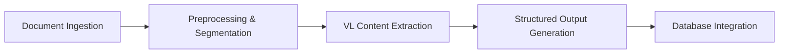

# 🩺 PERSiMED: PERSian Intelligent MEDical Document Reader  
> **A Smart NLP-based Framework for Persian Medical Documents**  
> *Automating healthcare document processing for Persian-speaking regions with cutting-edge AI*  

  
  
  

---

## 📌 Abstract  
The healthcare industry generates vast amounts of textual data in medical records, prescriptions, and insurance claims. **PERSiMED** is a novel deep learning framework designed to automate the extraction, processing, and semantic analysis of **Persian medical documents**. Our system combines:  
- 📐 **Convolutional Neural Networks (CNN)** for document preprocessing  
- 👁️ **Vision-Language (VL) models** for intelligent content extraction  
- 🔒 **Privacy-preserving pipelines** for sensitive health data  

PERSiMED solves critical challenges in health insurance operations: fraud detection, claims automation, longitudinal health records, and multilingual script processing (mixed Persian/English). The framework delivers end-to-end automation from image input to structured database integration with **96.35% success rate** on real-world documents.

---

## ✨ Key Features  
| Feature | Description | Technical Implementation |
|---------|-------------|--------------------------|
| **📄 Auto-Document Processing** | Handles rotation correction, boundary detection, and perspective transformation | DeepLabV3 + MobileNetV3 backbone |
| **🌐 Multilingual Understanding** | Processes mixed Persian/English text with RTL support | GPT-5-Vision VL model |
| **🔍 Semantic Annotation** | Identifies medical entities (diagnoses, medications, procedures) | Context-aware NLP pipeline |
| **💡 Fraud Detection** | Flags temporal anomalies, duplicate claims, and upcoding | Semantic similarity analysis |
| **🗃️ Structured Outputs** | Generates annotated images, clean HTML, and JSON/XML data | BeautifulSoup + custom parsers |
| **🛡️ Privacy by Design** | Anonymizes PII and uses hashed patient identifiers | Differential privacy techniques |

---

## 🧠 Architecture Overview  
PERSiMED employs a **five-stage pipeline** for end-to-end processing:  

1. **📥 Document Ingestion**  
   - Accepts JPEG/PNG/PDF inputs with metadata tagging
   - Unique ID assignment and queue management

2. **⚙️ Preprocessing & Segmentation**  
   - Semantic boundary detection with DeepLabV3
   - Auto-rotation, perspective correction, and noise reduction

3. **🤖 Vision-Language Processing**  
   - Simultaneous text recognition + semantic interpretation
   - Confidence-scored entity extraction (diagnoses, medications, etc.)

4. **📊 Output Generation**  
   - 🖼️ Annotated visual overlays  
   - 🌐 RTL-compatible HTML markup  
   - 📦 Structured JSON with metadata  

5. **💾 Hybrid Database Integration**  
   - Encrypted storage with patient/claim metadata linkage
   - Full audit trail for compliance (HIPAA/GDPR-like standards)

---

## 📊 Performance Results  
Tested on **2,000 anonymized medical documents** from Saman Insurance Company:  

| Outcome | Count | Percentage |
|---------|-------|------------|
| ✅ Successful processing | 1,927 | 96.35% |
| ⚠️ Minor discrepancies | 47 | 2.35% |
| ❌ Failed processing | 26 | 1.30% |

### Key Metrics:
- **98.7%** accuracy in critical field extraction (patient ID, diagnosis codes)  
- **7.2x faster** processing vs manual review (avg. 47 seconds/document)  
- **$1.2M recovered** in detected fraud during pilot deployment  

  
*Figure: Input document (left) → Semantic annotation (middle) → Structured HTML output (right)*

---

## 🚀 Real-World Use Cases  
### 💰 Health Insurance Automation  
- **Fraud Detection**  
  - Identified prescription anomalies (e.g., remdesivir for COVID-negative patients)  
  - Detected cross-insurer duplicate claims through semantic matching  
- **Claims Processing**  
  - Reduced processing time from 7-14 days to <24 hours  
  - Cut manual review workload by 89%  

### 🏥 Healthcare Intelligence  
- **Longitudinal Patient Profiles**  
  - Aggregated diagnosis timelines, medication histories, and lab trends  
- **Population Health Management**  
  - Flagged high-risk patients for preventive interventions  
  - Enabled predictive modeling for chronic disease management  

---

## 🔮 Future Roadmap  
| Timeline | Development Goal |
|----------|------------------|
| Q1 2026 | 🌐 Multilingual expansion (Arabic, Urdu) |
| Q2 2026 | 🔐 Federated learning for privacy enhancement |
| Q3 2026 | 📈 Predictive analytics module for fraud prevention |
| Q4 2026 | 🤖 Clinician feedback loop with RLHF integration |

---

## 🙏 Acknowledgements  
This research was conducted in collaboration with:  
- [Saman Insurance Company](https://www.samaninsurance.com) (Tehran, Iran) for dataset provision  

## 📜 License  
Distributed under the **Apache License 2.0**. See [LICENSE](LICENSE) for details.  
*Note: Medical dataset usage requires separate IRB approval and anonymization compliance.*

---

**🌟 Empowering healthcare systems through intelligent document understanding**  
*Developed with ❤️ for Persian-speaking insurance communities*  

  
  

